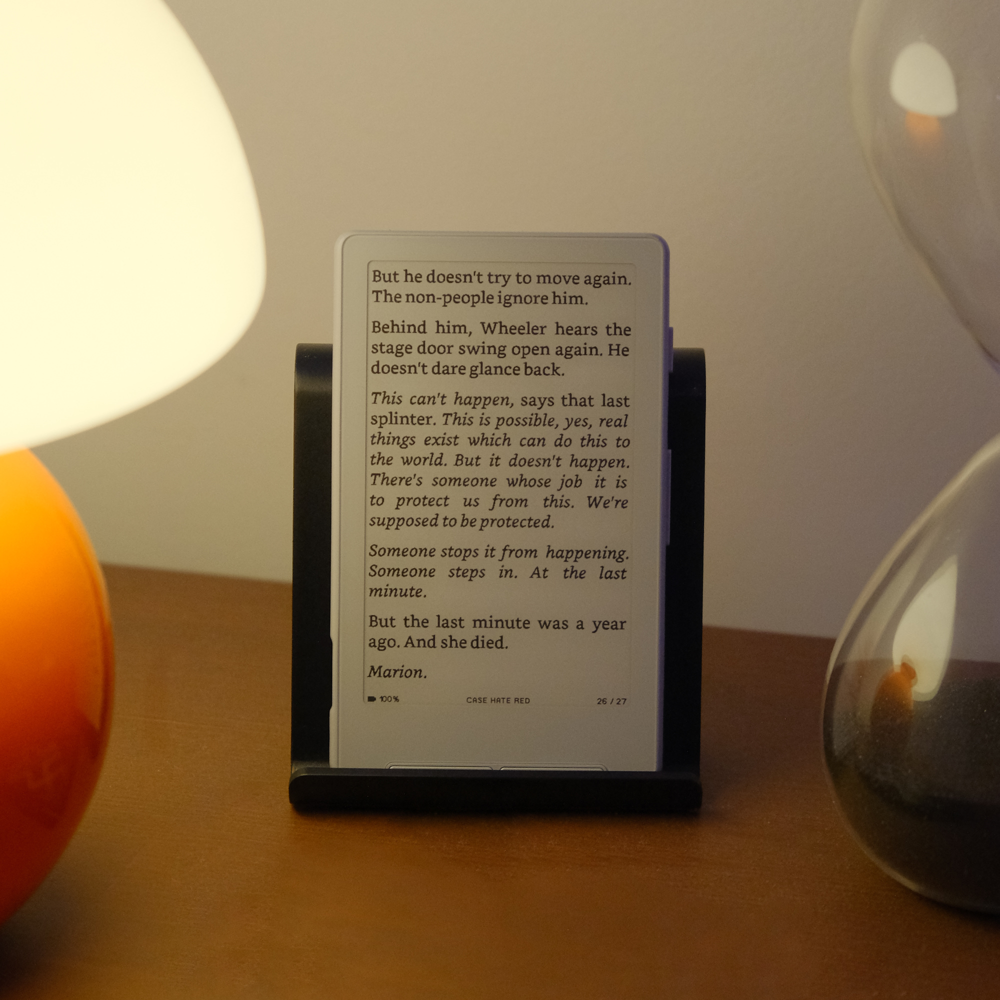

# CrossPoint Reader

Firmware for the **Xteink X4** e-paper display reader (unaffiliated with Xteink).
Built using **PlatformIO** and targeting the **ESP32-C3** microcontroller.

CrossPoint Reader is a purpose-built firmware designed to be a drop-in, fully open-source replacement for the official 
Xteink firmware. It aims to match or improve upon the standard EPUB reading experience.



## Motivation

E-paper devices are fantastic for reading, but most commercially available readers are closed systems with limited 
customisation. The **Xteink X4** is an affordable, e-paper device, however the official firmware remains closed.
CrossPoint exists partly as a fun side-project and partly to open up the ecosystem and truely unlock the device's
potential.

CrossPoint Reader aims to:
* Provide a **fully open-source alternative** to the official firmware.
* Offer a **document reader** capable of handling EPUB content on constrained hardware.
* Support **customisable font, layout, and display** options.
* Run purely on the **Xteink X4 hardware**.

This project is **not affiliated with Xteink**; it's built as a community project.


## Features & Usage

- **EPUB parsing and rendering** (EPUB 2 and EPUB 3)
- **Saved reading position**
- **File explorer** with nested folder support
- **Custom sleep screen** (with cover art)
- **WiFi book upload & OTA updates**
- **Configurable font, layout, and display options**
- **Screen rotation**
- **Multi-language support**: Read EPUBs in many languages ([see full list](./USER_GUIDE.md#supported-languages))

See [the user guide](./USER_GUIDE.md) for instructions. For project scope, see [SCOPE.md](SCOPE.md).

---

## New: GameBrick D-pad & Expanded Bluetooth HID Support

### GameBrick D-pad Support
- All D-pad directions (UP, DOWN, LEFT, RIGHT) are now detected and mapped correctly.
- Robust detection even with ambiguous or noisy HID reports.
- Spurious A/B button events during D-pad use are suppressed to prevent unwanted page turns.

### Broader Device Compatibility
- **Any GameBrick controller** (not just a specific unit) can now connect and work out-of-the-box. Please make sure it is in slow blink mode, not the pairing mode/fast flash.
- **Mini_Keyboard devices are also supported.** Mini_Keyboard is what the Gugxiom 2 Key Keypad from Amazon
- Standard HID arrow keys and page up/down keys are mapped to navigation actions.
- **Profile auto-detection:** The system matches known device profiles (GameBrick, Mini_Keyboard) by MAC address and device name, but will also fall back to auto-detection for unknown but compatible devices. I have no other page turners at this time to test with. It is coded to connect to any HID device but the device buttons may not be mapped to the generic codes or those for the two devices that are know to the firmware. 

### How to Use
1. Go to **Settings → Bluetooth** and enable Bluetooth.
2. Scan for devices and connect your GameBrick or Mini_Keyboard.
3. Use the D-pad or arrow keys to turn pages and navigate menus.
4. open a book, open the options (select button) and navigate to Bluetooth. works the same as the main menu settings.

### Technical Improvements
- Per-button cooldown logic prevents repeated/rapid accidental presses.
- Fallback detection ensures even non-standard or future GameBrick variants will work.
- Debug logging is now disabled for production use.

---

## Installing

### Web (latest firmware)

1. Connect your Xteink X4 to your computer via USB-C and wake/unlock the device
2. Go to https://xteink.dve.al/ and click "Flash CrossPoint firmware"

To revert back to the official firmware, you can flash the latest official firmware from https://xteink.dve.al/, or swap
back to the other partition using the "Swap boot partition" button here https://xteink.dve.al/debug.


### Web (specific firmware version)

1. Connect your Xteink X4 to your computer via USB-C
2. Download the `firmware.bin` file from this repository (see root directory or releases)
3. Go to https://xteink.dve.al/ and flash the firmware file using the "OTA fast flash controls" section

To revert back to the official firmware, you can flash the latest official firmware from https://xteink.dve.al/, or swap
back to the other partition using the "Swap boot partition" button here https://xteink.dve.al/debug.


### Manual
See [Development](#development) below.


## Development

### Prerequisites

* **PlatformIO Core** (`pio`) or **VS Code + PlatformIO IDE**
* Python 3.8+
* USB-C cable for flashing the ESP32-C3
* Xteink X4

### Checking out the code

CrossPoint uses PlatformIO for building and flashing the firmware. To get started, clone the repository:

```
git clone --recursive https://github.com/crosspoint-reader/crosspoint-reader

# Or, if you've already cloned without --recursive:
git submodule update --init --recursive
```

### Flashing your device

Connect your Xteink X4 to your computer via USB-C and run:

```sh
pio run --target upload
```
### Debugging

After flashing the new features, it’s recommended to capture detailed logs from the serial port.

First, make sure all required Python packages are installed:

```python
python3 -m pip install pyserial colorama matplotlib
```
after that run the script:
```sh
# For Linux
# This was tested on Debian and should work on most Linux systems.
python3 scripts/debugging_monitor.py

# For macOS
python3 scripts/debugging_monitor.py /dev/cu.usbmodem2101
```
Minor adjustments may be required for Windows.

## Internals

CrossPoint Reader is pretty aggressive about caching data down to the SD card to minimise RAM usage. The ESP32-C3 only
has ~380KB of usable RAM, so we have to be careful. A lot of the decisions made in the design of the firmware were based
on this constraint.

### Data caching

The first time chapters of a book are loaded, they are cached to the SD card. Subsequent loads are served from the 
cache. This cache directory exists at `.crosspoint` on the SD card. The structure is as follows:


```
.crosspoint/
├── epub_12471232/       # Each EPUB is cached to a subdirectory named `epub_<hash>`
│   ├── progress.bin     # Stores reading progress (chapter, page, etc.)
│   ├── cover.bmp        # Book cover image (once generated)
│   ├── book.bin         # Book metadata (title, author, spine, table of contents, etc.)
│   └── sections/        # All chapter data is stored in the sections subdirectory
│       ├── 0.bin        # Chapter data (screen count, all text layout info, etc.)
│       ├── 1.bin        #     files are named by their index in the spine
│       └── ...
│
└── epub_189013891/
```

Deleting the `.crosspoint` directory will clear the entire cache. 

Due the way it's currently implemented, the cache is not automatically cleared when a book is deleted and moving a book
file will use a new cache directory, resetting the reading progress.

For more details on the internal file structures, see the [file formats document](./docs/file-formats.md).

## Contributing

Contributions are very welcome!

If you're looking for a way to help out, take a look at the [ideas discussion board](https://github.com/crosspoint-reader/crosspoint-reader/discussions/categories/ideas).
If there's something there you'd like to work on, leave a comment so that we can avoid duplicated effort.

Everyone here is a volunteer, so please be respectful and patient. For more details on our goverance and community 
principles, please see [GOVERNANCE.md](GOVERNANCE.md).

### To submit a contribution:

1. Fork the repo
2. Create a branch (`feature/dithering-improvement`)
3. Make changes
4. Submit a PR

---

CrossPoint Reader is **not affiliated with Xteink or any manufacturer of the X4 hardware**.

Huge shoutout to [**diy-esp32-epub-reader** by atomic14](https://github.com/atomic14/diy-esp32-epub-reader), which was a project I took a lot of inspiration from as I
was making CrossPoint.
